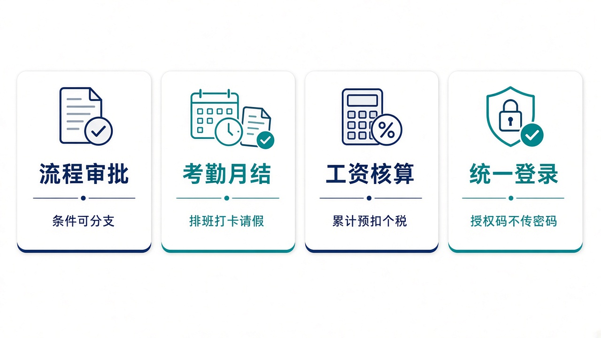
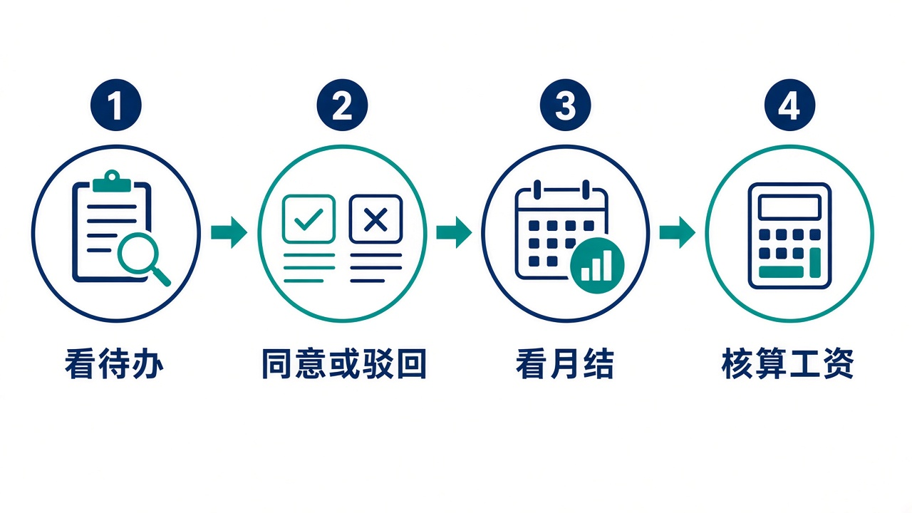

# 给大家讲：协同系统怎么用

OA 管组织人事、考勤、审批、工资，并给其他系统提供统一登录。控制塔可以发起带业务单号的审批、同意待办，但必须走开放接口。亮点短表见 [项目亮点](./项目亮点.md)。

## 适合什么场景

| 场景 | 在这里怎么做 |
| --- | --- |
| 请假、费用或通用事项要批 | 按流程发起。条件分支、多人、转办和撤回都在流程里 |
| 要算出勤 | 排班、打卡、请假走到日结和月结 |
| 要发工资 | 加班、扣款、社保、公积金和累计预扣个税在工资里算 |
| 别的系统要登录 | 用授权码加 PKCE，不把 OA 密码交给采购或 ERP |
| 控制塔要批一张业务单 | 走开放接口，业务单号记在流程上。通用流程的登录发起页不允许带业务编号 |

## 亮点

1. 待办落在具体审批人身上，同意时用的就是这个人。
2. 考勤和工资用同一套人事数据。
3. 集团登录不扩散密码。
4. 控制塔重复同意同一张待办，不会因为连点而跳过下一节点。

## 一天怎么用

1. 看自己的待办，先处理快到期的。
2. 同意、驳回或转办。驳回不会改采购订单或发票，那些单据在各自系统里。
3. 考勤月结前看异常打卡和未批请假。
4. 月结完成后再核算工资。

系统审批写的是流程。采购订单、开票申请要由对应系统自己的指令推进。
